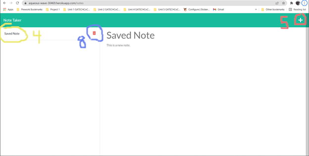

# Note Taker [](https://opensource.org/licenses/MIT)
  
  ## Description
  The note taker is a personal notepad for a young working professional. It uses an Express back-end to communicate with a JSON database. The data model stores notes, which have a title and a text property. The front end interface makes requests to the express back-end, which controls the viewing of these notes.

  ## TOC
  1. [Installation](#installation)   
  2. [Usage](#usage)                 
  3. [Contributors](#contributors)
  4. [Tests](#tests)
  5. [Questions](#questions)

  ## Installation
  ***
  Type these commands into git bash to install the application. Note Taker was created with
  [git bash](https://git-scm.com/) and [node package manager](https://nodejs.org/en/).

  ```
  $ git clone git@github.com:YellowYam/note-taker.git
  $ cd ../path/to/the/file
  $ npm install
  ``` 

  ## Usage
  Use the application from a Cloned Repo, or navigate to the [deployed application](https://aqueous-wave-30469.herokuapp.com/).
   ### Use From Cloned Repo
1. Navigate to the application directory.
2. Run <code>node server.js</code> to deploy the app on the localhost. (The http address will be logged to the console.)


3. In the browser, click "Get Started." You will be re-directed to the notes client. 
4. Click on a saved note listing displayed in an aside at the left of the viewscreen. If there are no saved notes, move onto the next step.



5. Click on the plus icon in the navigation header to open a new note, if you aren't already looking at a new note.
6. Type a note title and a note text. A save icon will appear next to the plus icon.
7. Click the save button to save your new note.
8. Delete buttons will appear on each saved note listing, and you can test this on your new note.

### Use From Heroku Deployment
1. Navigate to [Note Taker](https://aqueous-wave-30469.herokuapp.com/) in your browser. Right click the link to open a in new window.
2. Resume instructions from step 3 of [Use From Cloned Repo](#use-from-cloned-repo).

  ## Contributors
  If you would like to become a contributor on this project, please find my contact information in the [questions](#questions)
  section of this README.

  * Cody Scoles (YellowYam)

  ## Tests
  <br>
  At present, no tests can be performed on this code. The application meets all requirements without errors.

  ## Questions?
  <a href = "mailto:cody.scoles@gmail.com"> Email me! </a> <br>
  <a href = "https://www.github.com/YellowYam"> GitHub </a>

  ## License 

  [](https://opensource.org/licenses/MIT)<br>
  (The license badge is a clickable link.)

